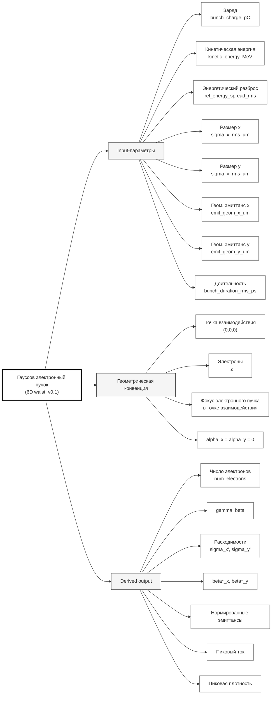

# I/O спецификация: гауссов электронный пучок v0.1

Проект: Валидация Комптона  
Версия спецификации: `v0.1`  
Статус: полный черновик / рабочий контракт

---

## 1. Назначение

Документ задает минимальный I/O-контракт для описания одиночного гауссова электронного сгустка в расчетах Комптоновского рассеяния.

Версия `v0.1` описывает электронный пучок как 6D гауссово распределение с фокусом в точке взаимодействия. Задаются заряд, энергия, энергетический разброс, поперечные размеры, геометрические эмиттансы и продольная длительность.

Эта спецификация предназначена для того, чтобы разные расчетные коды одинаково интерпретировали один и тот же входной файл.

---

## 2. Геометрическая конвенция

Используется правая декартова система координат.

- Точка взаимодействия электронного и лазерного пучков находится в начале координат:

$$
(x, y, z) = (0, 0, 0).
$$

- Электронный пучок распространяется вдоль оси:

$$
+z.
$$

- Лазерный пучок, если используется совместно со спецификацией лазера v0.1, распространяется навстречу электронам вдоль оси:

$$
-z.
$$

- В версии `v0.1` фокус электронного пучка находится в точке взаимодействия:

$$
z_{f,e} = 0.
$$

- В фокусе электронного пучка считаем:

$$
\alpha_x = 0,
$$

$$
\alpha_y = 0.
$$

То есть в точке взаимодействия отсутствуют линейные корреляции $x$--$x'$ и $y$--$y'$.

---

## 3. Минимальные входные параметры v0.1

### 3.1. Таблица входных параметров

| Поле | Обозначение | Единица | Описание |
|---|---:|---:|---|
| `bunch_charge_pC` | $Q$ | pC | Заряд одного электронного сгустка |
| `kinetic_energy_MeV` | $E_{\mathrm{kin}}$ | MeV | Средняя кинетическая энергия электронов |
| `rel_energy_spread_rms` | $\sigma_E/E$ | dimensionless | Относительный rms-разброс кинетической энергии |
| `sigma_x_rms_um` | $\sigma_{x0}$ | um | rms-размер пучка по $x$ в фокусе |
| `sigma_y_rms_um` | $\sigma_{y0}$ | um | rms-размер пучка по $y$ в фокусе |
| `emit_geom_x_um` | $\epsilon_x$ | um | Геометрический rms-эмиттанс по $x$ |
| `emit_geom_y_um` | $\epsilon_y$ | um | Геометрический rms-эмиттанс по $y$ |
| `bunch_duration_rms_ps` | $\sigma_t$ | ps | rms-длительность сгустка во времени |
| `propagation_direction` | — | — | Направление распространения электронов; в v0.1 фиксируется как `+z` |

### 3.2. Почему заряд задается в pC, а не nC

Основная единица для входного параметра заряда в v0.1:

```yaml
bunch_charge_pC: ...
```

Архитектурное решение: использовать `pC`, а не `nC`.

Причины:

- в задачах Комптоновского рассеяния встречаются как малые заряды порядка единиц--десятков pC, так и большие заряды порядка сотен pC или nC;
- запись `5 pC` удобнее и менее ошибочна, чем `0.005 nC`;
- nC-режимы всё равно легко задаются как `1000 pC`, `2000 pC` и т.д.;
- `pC` лучше подходит как универсальная единица для линейных ускорителей, LWFA-пучков и тестовых расчетов.

Конверсия:

$$
1\ \mathrm{pC} = 10^{-12}\ \mathrm{C},
$$

$$
1\ \mathrm{nC} = 1000\ \mathrm{pC}.
$$

---

## 4. Определение геометрического эмиттанса

В версии `v0.1` используются именно геометрические rms-эмиттансы, не нормированные эмиттансы.

Для горизонтального направления:

$$
\epsilon_x = \sqrt{\langle x^2 \rangle \langle x'^2 \rangle - \langle x x' \rangle^2}.
$$

Для вертикального направления:

$$
\epsilon_y = \sqrt{\langle y^2 \rangle \langle y'^2 \rangle - \langle y y' \rangle^2}.
$$

Здесь:

$$
x' \approx \frac{p_x}{p_z},
$$

$$
y' \approx \frac{p_y}{p_z}.
$$

В параксиальном приближении $x'$ и $y'$ являются малыми углами расходимости в радианах.

В точке фокуса электронного пучка:

$$
\langle x x' \rangle = 0,
$$

$$
\langle y y' \rangle = 0.
$$

Поэтому в v0.1:

$$
\epsilon_x = \sigma_{x0}\sigma_{x'},
$$

$$
\epsilon_y = \sigma_{y0}\sigma_{y'}.
$$

Отсюда rms-расходимости:

$$
\sigma_{x'} = \frac{\epsilon_x}{\sigma_{x0}},
$$

$$
\sigma_{y'} = \frac{\epsilon_y}{\sigma_{y0}}.
$$

Важно: единица `um` для геометрического эмиттанса означает:

$$
1\ \mathrm{um} = 10^{-6}\ \mathrm{m\,rad} = 1\ \mathrm{mm\,mrad}.
$$

Радиан считается безразмерным, но в документации полезно явно помнить, что речь идет об эмиттансе, а не о поперечном размере.

---

## 5. Поперечный профиль в фокусе

В точке взаимодействия, совпадающей с фокусом электронного пучка, плотность по поперечным координатам задается как

$$
n(x,y) \propto
\exp\left(
-\frac{x^2}{2\sigma_{x0}^2}
-\frac{y^2}{2\sigma_{y0}^2}
\right).
$$

Здесь:

- $\sigma_{x0}$ задается полем `sigma_x_rms_um`;
- $\sigma_{y0}$ задается полем `sigma_y_rms_um`.

Это rms-размеры плотности электронного пучка в фокусе.

Связь с FWHM:

$$
\mathrm{FWHM}_x = 2\sqrt{2\ln2}\,\sigma_{x0} \approx 2.35482\,\sigma_{x0},
$$

$$
\mathrm{FWHM}_y = 2\sqrt{2\ln2}\,\sigma_{y0} \approx 2.35482\,\sigma_{y0}.
$$

---

## 6. Угловой профиль

В v0.1 предполагается гауссово распределение по углам:

$$
f(x') \propto \exp\left(-\frac{x'^2}{2\sigma_{x'}^2}\right),
$$

$$
f(y') \propto \exp\left(-\frac{y'^2}{2\sigma_{y'}^2}\right).
$$

Так как фокус находится в точке взаимодействия и $\alpha_x=\alpha_y=0$, rms-расходимости определяются из геометрических эмиттансов и размеров:

$$
\sigma_{x'} = \frac{\epsilon_x}{\sigma_{x0}},
$$

$$
\sigma_{y'} = \frac{\epsilon_y}{\sigma_{y0}}.
$$

В этих формулах $\epsilon_x$, $\epsilon_y$, $\sigma_{x0}$, $\sigma_{y0}$ должны быть выражены в согласованных единицах, например в метрах.

Результат $\sigma_{x'}$, $\sigma_{y'}$ получается в радианах.

---

## 7. Twiss-параметры в фокусе

Хотя Twiss-параметры не являются входными параметрами v0.1, они могут быть вычислены как derived output.

В точке фокуса:

$$
\alpha_x = 0,
$$

$$
\alpha_y = 0.
$$

Бета-функции в фокусе:

$$
\beta_x^* = \frac{\sigma_{x0}^2}{\epsilon_x},
$$

$$
\beta_y^* = \frac{\sigma_{y0}^2}{\epsilon_y}.
$$

Гамма-функции Twiss:

$$
\gamma_x^* = \frac{1}{\beta_x^*},
$$

$$
\gamma_y^* = \frac{1}{\beta_y^*}.
$$

Это следует из стандартного соотношения:

$$
\beta\gamma - \alpha^2 = 1.
$$

---

## 8. Продольный профиль

В v0.1 продольный профиль задается через rms-длительность сгустка во времени:

```yaml
bunch_duration_rms_ps: ...
```

Не рекомендуется использовать имя `sigma_l_ps`, потому что оно может быть ошибочно прочитано как пространственная длина, а не временная длительность.

Временной профиль:

$$
n(t) \propto \exp\left(-\frac{t^2}{2\sigma_t^2}\right).
$$

Связь с FWHM-длительностью:

$$
\mathrm{FWHM}_t = 2\sqrt{2\ln2}\,\sigma_t \approx 2.35482\,\sigma_t.
$$

Пространственная rms-длина сгустка:

$$
\sigma_z = \beta_0 c \sigma_t.
$$

Для ультрарелятивистского пучка:

$$
\sigma_z \approx c\sigma_t.
$$

При использовании `bunch_duration_rms_ps` в ps:

$$
\sigma_z[\mathrm{um}] \approx 299.792458\,\beta_0\,\sigma_t[\mathrm{ps}].
$$

---

## 9. Энергия и релятивистские параметры

Входной параметр `kinetic_energy_MeV` задает среднюю кинетическую энергию электронов:

$$
E_{\mathrm{kin}}.
$$

Полная энергия электрона:

$$
E_{\mathrm{tot}} = E_{\mathrm{kin}} + m_ec^2.
$$

Используем:

$$
m_ec^2 = 0.51099895\ \mathrm{MeV}.
$$

Средний лоренц-фактор:

$$
\gamma_0 = 1 + \frac{E_{\mathrm{kin}}}{m_ec^2}.
$$

Средняя скорость в единицах скорости света:

$$
\beta_0 = \sqrt{1 - \frac{1}{\gamma_0^2}}.
$$

Средний импульс:

$$
p_0 c = \sqrt{E_{\mathrm{tot}}^2 - (m_ec^2)^2}.
$$

---

## 10. Энергетический разброс

Входное поле:

```yaml
rel_energy_spread_rms: ...
```

задает rms-разброс кинетической энергии:

$$
\sigma_{\delta_E} = \frac{\sigma_{E_{\mathrm{kin}}}}{\langle E_{\mathrm{kin}} \rangle}.
$$

То есть:

$$
\sigma_{E_{\mathrm{kin}}}
=
\texttt{rel\_energy\_spread\_rms}\cdot E_{\mathrm{kin}}.
$$

Для расчетов Комптоновского рассеяния часто полезнее разброс по $\gamma$:

$$
\sigma_\gamma = \frac{\sigma_{E_{\mathrm{kin}}}}{m_ec^2}.
$$

Относительный разброс по $\gamma$:

$$
\frac{\sigma_\gamma}{\gamma_0}
=
\frac{\sigma_{E_{\mathrm{kin}}}}{E_{\mathrm{kin}} + m_ec^2}.
$$

В ультрарелятивистском пределе:

$$
\frac{\sigma_\gamma}{\gamma_0}
\approx
\frac{\sigma_{E_{\mathrm{kin}}}}{E_{\mathrm{kin}}}.
$$

Но в спецификации v0.1 следует сохранять различие между относительным разбросом кинетической энергии и относительным разбросом по $\gamma$.

---

## 11. Заряд, число электронов и пиковый ток

Заряд сгустка:

$$
Q = \texttt{bunch\_charge\_pC}\times 10^{-12}\ \mathrm{C}.
$$

Число электронов:

$$
N_e = \frac{Q}{e}.
$$

Здесь:

$$
e = 1.602176634\times10^{-19}\ \mathrm{C}.
$$

Для гауссова временного профиля пиковый ток:

$$
I_{\mathrm{peak}}
=
\frac{Q}{\sqrt{2\pi}\sigma_t}.
$$

Здесь $Q$ должен быть в C, $\sigma_t$ в s, результат получается в A.

---

## 12. Пиковая плотность

Если распределение по координатам и времени гауссово, то полная плотность электронов может быть записана как

$$
n(x,y,z)
=
n_0
\exp\left(
-\frac{x^2}{2\sigma_x^2}
-\frac{y^2}{2\sigma_y^2}
-\frac{z^2}{2\sigma_z^2}
\right).
$$

Нормировка:

$$
N_e
=
\int n(x,y,z)\,dx\,dy\,dz.
$$

Отсюда пиковая плотность:

$$
n_0
=
\frac{N_e}{(2\pi)^{3/2}\sigma_x\sigma_y\sigma_z}.
$$

Если $\sigma_x$, $\sigma_y$, $\sigma_z$ заданы в cm, то $n_0$ получается в cm$^{-3}$.

---

## 13. 6D гауссово распределение v0.1

В версии `v0.1` электронный пучок задается как факторизованное 6D гауссово распределение:

$$
f(x,x',y,y',t,\delta_E)
=
f_x(x)f_{x'}(x')f_y(y)f_{y'}(y')f_t(t)f_E(\delta_E).
$$

Здесь:

$$
f_x(x) \propto \exp\left(-\frac{x^2}{2\sigma_{x0}^2}\right),
$$

$$
f_{x'}(x') \propto \exp\left(-\frac{x'^2}{2\sigma_{x'}^2}\right),
$$

$$
f_y(y) \propto \exp\left(-\frac{y^2}{2\sigma_{y0}^2}\right),
$$

$$
f_{y'}(y') \propto \exp\left(-\frac{y'^2}{2\sigma_{y'}^2}\right),
$$

$$
f_t(t) \propto \exp\left(-\frac{t^2}{2\sigma_t^2}\right),
$$

$$
f_E(\delta_E) \propto \exp\left(-\frac{\delta_E^2}{2\sigma_{\delta_E}^2}\right).
$$

В v0.1 отсутствуют корреляции:

$$
\langle x x' \rangle = 0,
$$

$$
\langle y y' \rangle = 0,
$$

$$
\langle z\delta_E \rangle = 0,
$$

и отсутствуют все поперечно-продольные корреляции.

---

## 14. Минимальный пример входного файла

```yaml
electron_beam:
  model: gaussian_6d_waist
  version: "0.1"

  bunch_charge_pC: 100.0

  kinetic_energy_MeV: 200.0
  rel_energy_spread_rms: 0.001

  sigma_x_rms_um: 10.0
  sigma_y_rms_um: 10.0

  emit_geom_x_um: 0.05
  emit_geom_y_um: 0.05

  bunch_duration_rms_ps: 1.0

  propagation_direction: "+z"
```

---

## 15. Рекомендуемые derived output-параметры

Код, читающий такой input, должен уметь вычислить и, по возможности, сохранить следующие производные параметры.

| Поле | Единица | Описание |
|---|---:|---|
| `bunch_charge_C` | C | Заряд сгустка в кулонах |
| `bunch_charge_nC` | nC | Заряд сгустка в нанокулонах |
| `num_electrons` | dimensionless | Число электронов $N_e$ |
| `gamma_mean` | dimensionless | Средний лоренц-фактор $\gamma_0$ |
| `beta_mean` | dimensionless | Среднее $\beta_0=v/c$ |
| `total_energy_MeV` | MeV | Полная энергия электрона |
| `sigma_E_kin_MeV` | MeV | rms-разброс кинетической энергии |
| `sigma_gamma` | dimensionless | rms-разброс по $\gamma$ |
| `sigma_gamma_over_gamma` | dimensionless | Относительный rms-разброс по $\gamma$ |
| `sigma_z_rms_um` | um | rms-длина сгустка |
| `duration_fwhm_ps` | ps | FWHM-длительность сгустка |
| `sigma_x_fwhm_um` | um | FWHM-размер по $x$ |
| `sigma_y_fwhm_um` | um | FWHM-размер по $y$ |
| `divergence_rms_x_rad` | rad | rms-расходимость по $x$ |
| `divergence_rms_y_rad` | rad | rms-расходимость по $y$ |
| `divergence_rms_x_mrad` | mrad | rms-расходимость по $x$ |
| `divergence_rms_y_mrad` | mrad | rms-расходимость по $y$ |
| `beta_star_x_um` | um | $\beta_x^*$ в фокусе |
| `beta_star_y_um` | um | $\beta_y^*$ в фокусе |
| `emit_norm_x_um` | um | Нормированный rms-эмиттанс по $x$ |
| `emit_norm_y_um` | um | Нормированный rms-эмиттанс по $y$ |
| `peak_current_A` | A | Пиковый ток сгустка |
| `peak_density_cm3` | cm$^{-3}$ | Пиковая плотность электронов |

Нормированные эмиттансы:

$$
\epsilon_{n,x} = \beta_0\gamma_0\epsilon_x,
$$

$$
\epsilon_{n,y} = \beta_0\gamma_0\epsilon_y.
$$

---

## 16. Проверки валидности input

Минимальные проверки:

```text
bunch_charge_pC > 0
kinetic_energy_MeV > 0
rel_energy_spread_rms >= 0
sigma_x_rms_um > 0
sigma_y_rms_um > 0
emit_geom_x_um > 0
emit_geom_y_um > 0
bunch_duration_rms_ps > 0
propagation_direction == "+z"
```

Дополнительные предупреждения:

```text
if rel_energy_spread_rms > 0.1:
    warn("Large relative energy spread; check whether this is intended.")

if divergence_rms_x_mrad > 100 or divergence_rms_y_mrad > 100:
    warn("Large angular divergence; paraxial approximation may be questionable.")

if emit_geom_x_um is suspiciously large compared with sigma_x_rms_um:
    warn("Check units: emit_geom_x_um means geometric emittance in um = mm mrad, not transverse size.")

if bunch_charge_pC > 10000:
    warn("Very large bunch charge; check whether pC/nC conversion is correct.")
```

---

## 17. Не входит в v0.1

В версии `v0.1` явно не описываются:

- нормированные эмиттансы как входные параметры;
- Twiss-параметры $\alpha$, $\beta$, $\gamma$ как независимые input;
- смещение фокуса электронного пучка относительно точки взаимодействия;
- поперечные смещения $x_0$, $y_0$;
- угловые смещения $x'_0$, $y'_0$;
- дисперсия и хроматические корреляции;
- энергетический chirp вдоль сгустка;
- корреляции $z$--$E$;
- поперечно-продольные корреляции;
- slice emittance;
- негауссов продольный профиль тока;
- негауссовы хвосты и halo;
- микробанчинг;
- спин и поляризация электронов;
- space charge;
- CSR;
- wakefields;
- коллективная динамика внутри сгустка;
- эволюция пучка до и после точки взаимодействия.

---

## 18. Mermaid-схема v0.1


