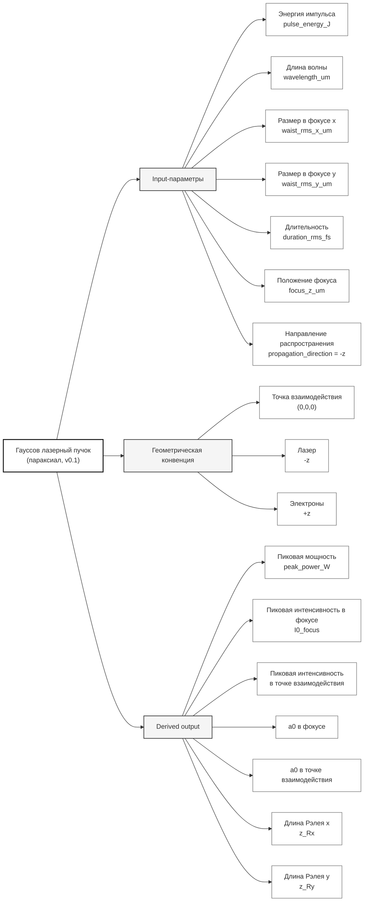

# I/O спецификация: гауссов параксиальный лазерный пучок v0.1

Проект: Валидация Комптона  
Версия спецификации: `v0.1`  
Статус: черновик / минимальный рабочий контракт

---

## 1. Назначение

Этот документ задает минимальный формат входных и выходных параметров для описания одиночного гауссова параксиального лазерного импульса в расчетах Комптоновского рассеяния.

Версия `v0.1` является минимальной: фиксируются только параметры, необходимые для однозначного задания энергии, фокуса, поперечного размера, длительности и длины волны лазерного импульса.

---

## 2. Геометрическая конвенция

Используется правая декартова система координат.

- Точка взаимодействия электронного и лазерного пучков находится в начале координат: $(x, y, z) = (0, 0, 0)$.
- Электронный пучок распространяется вдоль оси $+z$.
- Лазерный пучок распространяется навстречу электронам, вдоль оси $-z$.
- Положение фокуса лазера задается координатой `focus_z_um` относительно точки взаимодействия.

То есть:

$$z_f = \texttt{focus\_z\_um}.$$

Если $z_f = 0$, то фокус лазера находится точно в точке взаимодействия.

---

## 3. Минимальные входные параметры v0.1

### 3.1. Таблица входных параметров

| Поле | Обозначение | Единица | Описание |
|---|---:|---:|---|
| `pulse_energy_J` | $E_L$ | J | Энергия одного лазерного импульса |
| `wavelength_um` | $\lambda$ | um | Центральная длина волны лазера |
| `waist_rms_x_um` | $\sigma_{x0}$ | um | rms-размер интенсивности в фокусе по оси $x$ |
| `waist_rms_y_um` | $\sigma_{y0}$ | um | rms-размер интенсивности в фокусе по оси $y$ |
| `duration_rms_fs` | $\sigma_t$ | fs | rms-длительность интенсивности |
| `focus_z_um` | $z_f$ | um | Положение фокуса относительно точки взаимодействия |
| `propagation_direction` | — | — | Направление распространения лазера. В v0.1 должно быть `-z` |

---

## 4. Определение поперечного размера

В версии `v0.1` поперечный профиль интенсивности в фокусе задается как

$$I(x,y) = I_0 \exp\left(-\frac{x^2}{2\sigma_{x0}^2} - \frac{y^2}{2\sigma_{y0}^2}\right).$$

Здесь:

- $\sigma_{x0}$ — rms-размер интенсивности по $x$ в фокусе;
- $\sigma_{y0}$ — rms-размер интенсивности по $y$ в фокусе.

Важно: это rms-размер **интенсивности**, а не поля.

### 4.1. Связь с FWHM

Для одномерного гауссова профиля

$$I(x) = I_0 \exp\left(-\frac{x^2}{2\sigma_x^2}\right)$$

полная ширина на половине максимума равна

$$\mathrm{FWHM}_x = 2\sqrt{2\ln 2}\,\sigma_x \approx 2.35482\,\sigma_x.$$

Отсюда

$$\sigma_x = \frac{\mathrm{FWHM}_x}{2\sqrt{2\ln 2}} \approx \frac{\mathrm{FWHM}_x}{2.35482}.$$

Аналогично для $y$.

### 4.2. Связь с лазерным радиусом $w_0$

Часто гауссов пучок задают через радиус $w_0$ по уровню $1/e^2$ интенсивности:

$$I(x) = I_0 \exp\left(-\frac{2x^2}{w_0^2}\right).$$

Тогда

$$w_0 = 2\sigma_x,$$

или

$$\sigma_x = \frac{w_0}{2}.$$

Полный диаметр по уровню $1/e^2$:

$$D_{1/e^2} = 2w_0 = 4\sigma_x.$$

---

## 5. Определение длительности

В версии `v0.1` временной профиль интенсивности задается как

$$I(t) = I_0 \exp\left(-\frac{t^2}{2\sigma_t^2}\right).$$

Здесь:

$$\sigma_t = \texttt{duration\_rms\_fs}.$$

Важно: это rms-длительность **интенсивности**, а не поля.

### 5.1. Связь с FWHM-длительностью

$$\mathrm{FWHM}_t = 2\sqrt{2\ln 2}\,\sigma_t \approx 2.35482\,\sigma_t.$$

Отсюда

$$\sigma_t = \frac{\mathrm{FWHM}_t}{2\sqrt{2\ln 2}} \approx \frac{\mathrm{FWHM}_t}{2.35482}.$$

Например, если длительность лазерного импульса равна $30\ \mathrm{fs}$ FWHM, то

$$\sigma_t \approx \frac{30}{2.35482}\ \mathrm{fs} \approx 12.74\ \mathrm{fs}.$$

---

## 6. Энергия, пиковая мощность и пиковая интенсивность

В фокусе полная пространственно-временная интенсивность задается как

$$I(x,y,t) = I_{0,\mathrm{focus}} \exp\left(-\frac{x^2}{2\sigma_{x0}^2} - \frac{y^2}{2\sigma_{y0}^2} - \frac{t^2}{2\sigma_t^2}\right).$$

Энергия импульса:

$$E_L = \int I(x,y,t)\,dx\,dy\,dt.$$

Для выбранной нормировки:

$$E_L = I_{0,\mathrm{focus}} (2\pi)^{3/2} \sigma_{x0}\sigma_{y0}\sigma_t.$$

Отсюда пиковая интенсивность в фокусе:

$$I_{0,\mathrm{focus}} = \frac{E_L}{(2\pi)^{3/2}\sigma_{x0}\sigma_{y0}\sigma_t}.$$

В версии `v0.1` пиковая интенсивность в I/O-документе задается в W/cm$^2$, а не в W/m $^2$. Поэтому для прямого вычисления $I_{0,\mathrm{focus}}$ в W/cm$^2$ нужно использовать:

- $E_L$ в J;
- $\sigma_{x0}$, $\sigma_{y0}$ в cm;
- $\sigma_t$ в s.

Тогда результат $I_{0,\mathrm{focus}}$ получается в W/cm $^2$.

Конверсия из входных единиц:

$$\sigma_{x0,\mathrm{cm}} = 10^{-4}\,\sigma_{x0,\mu m},$$

$$\sigma_{y0,\mathrm{cm}} = 10^{-4}\,\sigma_{y0,\mu m},$$

$$\sigma_{t,\mathrm{s}} = 10^{-15}\,\sigma_{t,\mathrm{fs}}.$$

Если код внутренне считает интенсивность в СИ, то:

$$I[\mathrm{W/cm^2}] = 10^{-4} I[\mathrm{W/m^2}].$$

Пиковая мощность импульса:

$$P_{\mathrm{peak}} = \int I(x,y,t=0)\,dx\,dy.$$

Для выбранной нормировки:

$$P_{\mathrm{peak}} = 2\pi I_{0,\mathrm{focus}} \sigma_{x0}\sigma_{y0}.$$

В этой формуле нужно использовать согласованные единицы площади. Если $I_{0,\mathrm{focus}}$ задана в W/cm$^2$, то $\sigma_{x0}$ и $\sigma_{y0}$ должны быть в cm. Тогда $P_{\mathrm{peak}}$ получается в W.

Эквивалентно:

$$P_{\mathrm{peak}} = \frac{E_L}{\sqrt{2\pi}\sigma_t}.$$

---

## 7. Длина Рэлея

Для каждого поперечного направления вводится свой эффективный радиус по уровню $1/e^2$:

$$w_{0x} = 2\sigma_{x0},$$

$$w_{0y} = 2\sigma_{y0}.$$

Тогда соответствующие длины Рэлея:

$$z_{Rx} = \frac{\pi w_{0x}^2}{\lambda} = \frac{4\pi\sigma_{x0}^2}{\lambda},$$

$$z_{Ry} = \frac{\pi w_{0y}^2}{\lambda} = \frac{4\pi\sigma_{y0}^2}{\lambda}.$$

В этих формулах $\sigma_{x0}$, $\sigma_{y0}$, $\lambda$ должны быть выражены в одних и тех же единицах.

---

## 8. Размер пучка в точке взаимодействия

Если фокус смещен относительно точки взаимодействия, то размер пучка в точке $z=0$ отличается от размера в фокусе.

Для лазера, распространяющегося вдоль $-z$, расстояние от точки взаимодействия до фокуса по модулю равно

$$\Delta z = |z_f|.$$

В версии `v0.1` используем стандартную параксиальную формулу:

$$\sigma_x(z=0) = \sigma_{x0}\sqrt{1 + \left(\frac{z_f}{z_{Rx}}\right)^2},$$

$$\sigma_y(z=0) = \sigma_{y0}\sqrt{1 + \left(\frac{z_f}{z_{Ry}}\right)^2}.$$

Пиковая интенсивность в точке взаимодействия:

$$I_{0,\mathrm{interaction}} = I_{0,\mathrm{focus}} \frac{\sigma_{x0}\sigma_{y0}}{\sigma_x(z=0)\sigma_y(z=0)}.$$

Если $z_f = 0$, то

$$I_{0,\mathrm{interaction}} = I_{0,\mathrm{focus}}.$$

---

## 9. Нормированная амплитуда $a_0$

В версии `v0.1` $a_0$ не является входным параметром. Он вычисляется как производная величина из пиковой интенсивности и длины волны.

Используется стандартное определение для плоской волны:

$$a_0 = \frac{e E_0}{m_e c \omega_0},$$

где

$$\omega_0 = \frac{2\pi c}{\lambda}.$$

Связь пиковой интенсивности и амплитуды электрического поля в СИ:

$$I_0 = \frac{1}{2}\varepsilon_0 c E_0^2.$$

Тогда

$$E_0 = \sqrt{\frac{2I_0}{\varepsilon_0 c}}.$$

И

$$a_0 = \frac{e}{m_e c \omega_0}\sqrt{\frac{2I_0}{\varepsilon_0 c}}.$$

Для практического использования, если $I_0$ задана в W/cm$^2$, а $\lambda$ — в микрометрах:

$$a_0 \approx 0.855\,\lambda_{\mu m}\sqrt{\frac{I_0}{10^{18}\ \mathrm{W/cm^2}}}.$$

В выходных данных рекомендуется указывать два значения:

| Поле | Описание |
|---|---|
| `a0_focus` | $a_0$, рассчитанный по пиковой интенсивности в фокусе |
| `a0_interaction` | $a_0$, рассчитанный по пиковой интенсивности в точке взаимодействия |

Если фокус находится в точке взаимодействия, эти значения совпадают.

---

## 10. Минимальный пример входного файла

```yaml
laser:
  model: gaussian_paraxial
  version: "0.1"

  pulse_energy_J: 0.05

  wavelength_um: 0.8

  waist_rms_x_um: 2.5
  waist_rms_y_um: 2.5

  duration_rms_fs: 12.74

  focus_z_um: 0.0

  propagation_direction: "-z"
```

---

## 11. Рекомендуемые derived output-параметры

Код, читающий такой input, должен уметь вычислить и, по возможности, сохранить следующие производные параметры:

| Поле | Единица | Описание |
|---|---:|---|
| `waist_1e2_radius_x_um` | um | $w_{0x} = 2\sigma_{x0}$ |
| `waist_1e2_radius_y_um` | um | $w_{0y} = 2\sigma_{y0}$ |
| `waist_fwhm_x_um` | um | $\mathrm{FWHM}_x = 2\sqrt{2\ln2}\sigma_{x0}$ |
| `waist_fwhm_y_um` | um | $\mathrm{FWHM}_y = 2\sqrt{2\ln2}\sigma_{y0}$ |
| `duration_fwhm_fs` | fs | $\mathrm{FWHM}_t = 2\sqrt{2\ln2}\sigma_t$ |
| `rayleigh_length_x_um` | um | $z_{Rx}$ |
| `rayleigh_length_y_um` | um | $z_{Ry}$ |
| `peak_power_W` | W | $P_{\mathrm{peak}}$ |
| `peak_intensity_focus_W_cm2` | W/cm$^2$ | $I_{0,\mathrm{focus}}$ |
| `peak_intensity_interaction_W_cm2` | W/cm$^2$ | $I_{0,\mathrm{interaction}}$ |
| `a0_focus` | dimensionless | $a_0$ в фокусе |
| `a0_interaction` | dimensionless | $a_0$ в точке взаимодействия |

---

## 12. Проверки валидности input

Минимальные проверки:

```text
pulse_energy_J > 0
wavelength_um > 0
waist_rms_x_um > 0
waist_rms_y_um > 0
duration_rms_fs > 0
focus_z_um is finite
propagation_direction == "-z"
```

Дополнительные предупреждения:

```text
if abs(focus_z_um) >> rayleigh_length_x_um or abs(focus_z_um) >> rayleigh_length_y_um:
    warn("Фокус далеко от точки взаимодействия; интенсивность в точке взаимодействия может быть существенно ниже пиковой интенсивности в фокусе.")

if waist_rms_x_um != waist_rms_y_um:
    warn("Пучок эллиптический в фокусе. Это разрешено в v0.1, но астигматизм как разные положения фокусов по x/y пока не поддерживается.")
```

---

## 13. Не входит в v0.1

В версии `v0.1` явно не описываются:

- частота повторения импульсов `f_rep`;
- средняя мощность `P_avg`;
- пиковая мощность `P_peak` как независимый входной параметр;
- астигматизм в смысле разных положений фокуса `z_fx != z_fy`;
- комплексные q-параметры `q_x`, `q_y`;
- качество пучка `M²`;
- поляризация;
- начальная фаза / CEP;
- chirp / частотная модуляция;
- пространственно-временные связи;
- поперечные смещения пучка относительно оси;
- угол падения лазера;
- произвольное направление распространения;
- негауссовы профили;
- супергауссовы профили;
- моды Лагерра-Гаусса;
- моды Эрмита-Гаусса;
- несколько лазерных импульсов;
- накопление дозы, нагрева и эффектов от частоты повторения.

---

## 14. Mermaid-схема v0.1


